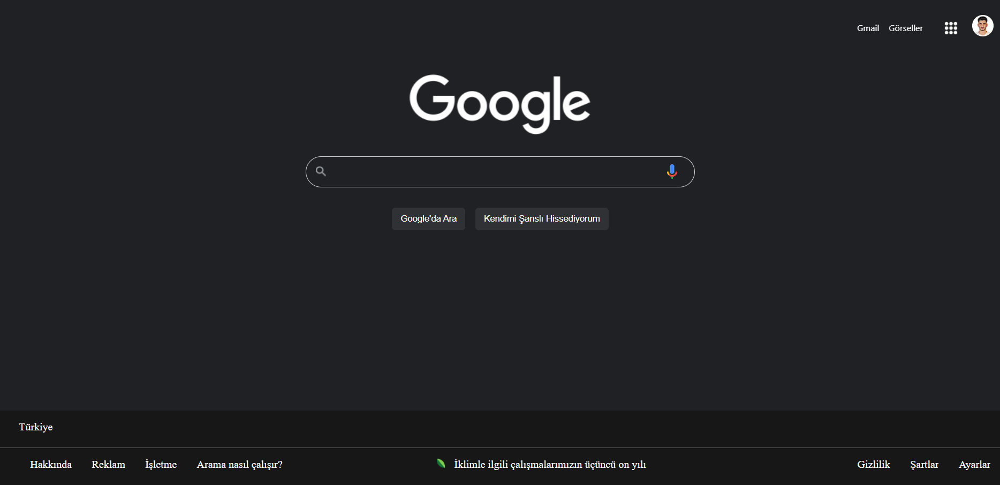

# Kodluyoruz Eğitimi CSS Çalışması

Kodluyoruz **CSS Eğitimi** kapsamında yaptığım çalışma

- Google Web Sayfasının aynısını HTML & CSS kullanarak Yapmaya çalıştım.
- index.html, style.css, olarak 2 kod sayfası bölümden oluşuyor.
- Yaptığım Çalışmamın Görüntüsü ;
  

## Installation

Öncelikle Projeyi Clonelayın

```
https://github.com/ykurt56/google-new-design.git
```

## Usage

Projeyi cloneladıktan sonra Visual Studio Code programında açınız.

Lunix için:

    cd CSS-Google-new-design
    code .
